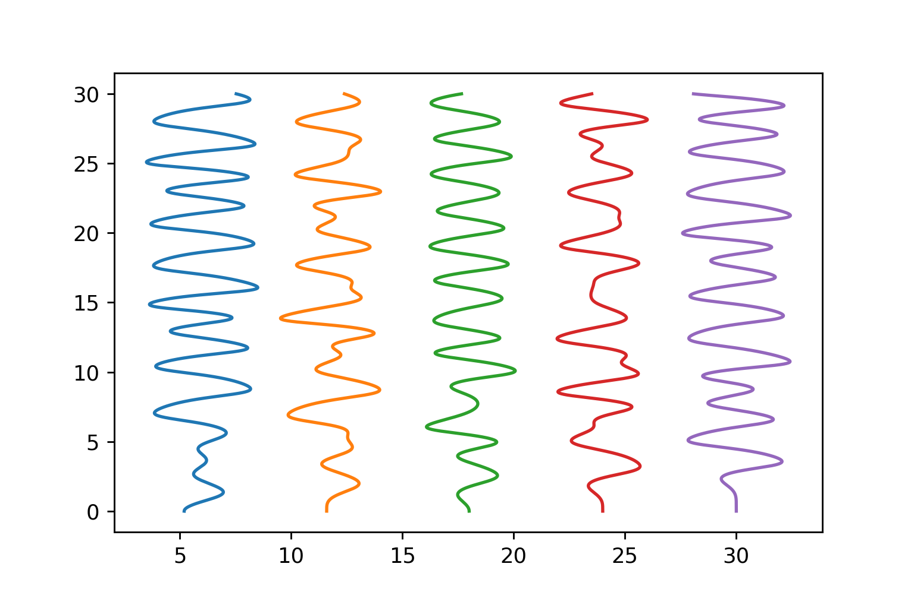
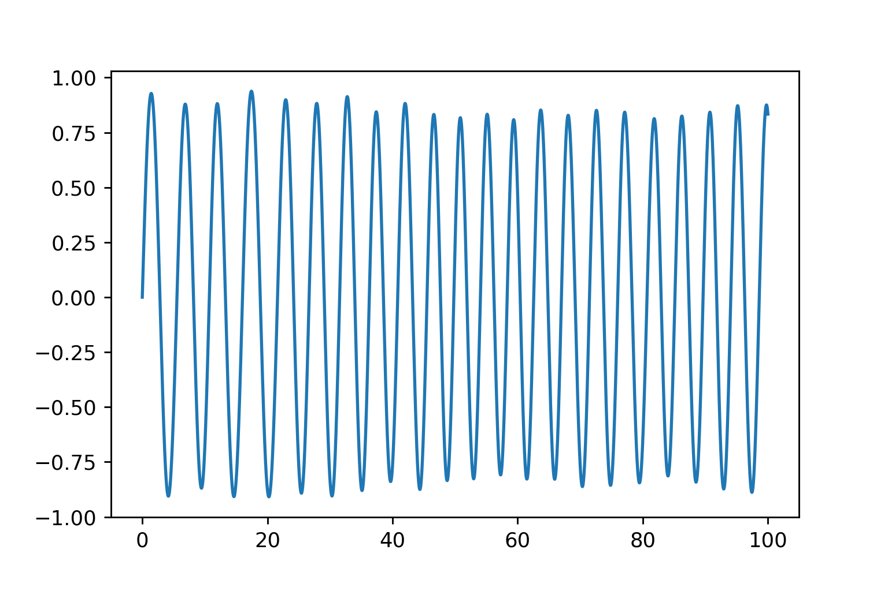

\newpage

# Introduction

## Overview
This project provides an overview of Monte Carlo methods as applied to the field of ordinary differential equations.
Monte Carlo methods are a broad class of numerical techniques.
Generally speaking, they are unified by the fact that they leverage randomness.
Monte Carlo methods are used for Markov Chain simulation, global optimization problems, and integration problems.
They are highly preferred by physicists and statisticians because of their conceptual similarity to statistical modelling.
In this report, we study two model problems which fall under the Monte Carlo umbrella: fitting parameters to a model given noisy input data by using simulated annealing,
and numerically solving the realizations of a harmonic oscillator with a stochastic spring constant (an SDE).
The problems chosen are meant to demonstrate the versatility and applicability of Monte Carlo to real-world problems.

## Simulated Annealing

Simulated annealing algorithms are stochastic methods that are used for global optimization problems.
They require very little information from the function to be optimized: only an evaluation method is needed, in contrast to gradient-descent based methods, which require a jacobian.
As such, they can be used to fit parameters to models given a set of data, via the minimization of a cost function which measures the difference between the model predictions and input data.
The convergence rates of simulated annealing are not well-studied, although it is known that the basic forms of the algorithm do converge to a global optimum [@granville1994simulated].
Simulated annealing algorithms remain highly popular in biology and other fields, precisely because of their versatility [@kalos2009monte; @higham2001algorithmic].
They are known to perform well on problems with a high number of parameters, especially in contrast to nonlinear least squares.

In Part 1 of this project, we study the effectiveness of simulated annealing algorithms on fitting parameters for models of systems governed by differential equations.
To this end we study a system of $N$ coupled harmonic oscillators, as well as a system of $N$ coupled Van der Pol oscillators.
We derive and numerically solve the systems for fixed spring constants $k_i$ and damping constants $\mu_i$ using an adaptive ODE solver, then artificially inject noise to the solutions.
Then, we use simulated annealing to fit the generated data and compare its performance to a competitor algorithm (nonlinear least-squares).
We find that simulated annealing performs better than nonlinear least-squares for a threshold value of $N > N_{\text{cutoff}}$, demonstrating the power of annealing for large sets of parameters.

## Stochastic Differential Equations (SDEs)

SDEs are differential equations which express how a quantity changes when it depends on a random process.
A model SDE is the geometric Brownian motion, which is given by

$$dX = \mu(t) X dt + \sigma(t) X dB,$$

and has an exact solution given by

$$X_0 \exp \left( \mu t - \frac{\sigma^2}{2} t + \sigma W(t) \right) + dW.$$

SDEs are popular in finance, where they are used to model the rise and fall of stock prices and the valuation of portfolios [@roberts2009elementary].
In spite of their popularity, finding the analytic solution to many SDEs remains challenging.
As such, computer simulation is a versatile first step to understanding the quantitative behaviour of a given SDE.

In Part 2 of this project, we study the numerically generated realizations of the stochastic harmonic oscillator.
This is the equation of a simple harmonic oscillator whose spring constant $k$ is a function of a Brownian motion $B(t)$ and has mean $k_{mean} = 1$.
We simulate the SDE using a form of Euler-Maruyama timestepping, a low-order numerical method whose realizations are known to converge to the true distribution in a formal sense.
We find that the resulting solution paths resemble the solution of a simple harmonic oscillator with constant $k = 1$ over short timescales,
but that to large enough timescales typical solution paths tend to oscillate with much higher frequency and amplitude than the exact solution.
We also try to sample a set of paths from our SDE and to fit an SDE model with an unknown mean and standard deviation to the generated paths.
We use dual annealing to fit our model, as in Part 1.
To our surprise, the model is fit to the original parameters with a reasonable order-of-magnitude degree of accuracy, even with modest (1 minute) runtimes and a naive implementation.
The results appear to suggest that it is reasonable to fit the distribution parameters of an SDE using global optimization.

# Fitting a Model of Van der Pol Oscillators with Noisy Data.

In this section we study the problem of fitting a model to data generated by a system of coupled harmonic oscillators.
The generated data is inexact because it is assumed that the measurement apparatus has some uncertainty associated with it.

## Derivation of the system.

Suppose there are $N$ masses with unit mass and coupled to each other by springs. When the masses are distance $d$ apart from each other, the system is in rest position, ie. no force is exerted by any of the springs. Two boards with fixed positions $x_0 = 0$ and $x_{N+1} = (N+1)d$ hold the system of springs in place, and there are $N + 1$ springs in total. The spring constants $k_i$ of the $i$th spring may or may not be uniform.

Now consider an initial condition on the spring system where the first mass is displaced from its rest position. Then because the masses are coupled, all masses experience a force caused by the displacement of the leftmost mass. Labelling the masses $1, \ldots, i, \ldots, N$, the springs $0, \ldots, i, \ldots, N + 1$, and letting $\Delta x_i$, $F(i)$ be the displacement from rest position and force felt by mass $i$ respectively, we find

$$F(i) = -k_{i - 1} \left( \Delta x_i - \Delta x_{i - 1} \right) + k_i \left( \Delta x_{i + 1} - \Delta x_i \right)$$.

For convenience we define $\Delta x_0 = \Delta x_{N + 1} = 0$, which also agrees with our model if we think of the left and rightmost boards as the $0$th and $N + 1$th masses, respectively. Since $F(i) = \partial_{tt} \Delta x$ is the acceleration felt by mass $i$ we are left with a linear system of second-order ODEs.

A fairly standard transformation $x_i'' = f(t, x_i) \rightarrow [ x_i' = v_i, v_i' = f(t, x) ]$ converts each second-order ODE into a set of two first-order ODEs, with the independent variable being time and the dependent variables being the displacement $x_i$ and the velocity $v_i$. The resulting system can then be plugged into a standard numerical ODE solver; for instance `scipy`'s `solve_ivp` method, which uses Runge-Kutta 4(5) by default.

The Python code for this system contains possibly too much Python-specific trivia to be of use to MATLAB users, but it can be found on the web (see Implementation Notes). Figure XXX shows a few frames of a simulation for a system of 5 masses with a uniform spring constant. In the initial condition both masses 1 and 2 are perturbed.

The choice to use this system was inspired in part by a problem in Trefethen's *Numerical Linear Algebra* [].

## Remark: Finite Difference Operators and the Method of Lines

As a fun fact, we notice that if the spring constants $k_i$ are all equal to $k$, then the equation for the force on mass $i$ reduces to

$$F(i) = k \left( \Delta x_{i + 1} - 2 \Delta x_i + \Delta x_{i - 1} \right)$$

which may look similar to the second-order finite difference operator for a second derivative, $\partial_{xx} u(x) \approx \frac{u(x + h) - 2 u(x) + u(x - h)}{\Delta x^2}$.
Thus with an appropriate scaling the system of coupled springs and masses with uniform spring constants $k$ is simply a method-of-lines approximation to the wave equation PDE $u_{tt} = u_{xx}$.

## The Van der Pol oscillator.

The Van der Pol oscillator is a close relative of the simple harmonic oscillator and is often used as a first example of an ordinary differential equation with nonlinear damping. In particular, the equation of a single oscillator takes the form

$$u'' - \mu(1 - u^2) u' + u = 0$$

we can compare this with the equation of the damped harmonic oscillator,

$$u'' + \mu u' + u = 0.$$

For the latter equation we know that $\mu u'$ is a damping term that causes the mass to lose energy over time, proportional to the current speed of the mass.
In contrast, the nonlinear damping term $\mu(1 - u^2)$ in the Van der Pol oscillator changes sign when $u = 1$.
For $u' > 1$, the system is damped, but for $u < 1$, the term actually acts as a *forcing term*, increasing the acceleration felt by the mass.
For this reason, the typical long-term solutions of a Van der Pol oscillator will be a periodic wave.
Experimentally, it appears that the amplitude of this wave is around 2.

In Figure XXX we show profiles of the phase plane for the damped harmonic oscillator and Van der Pol oscillator.
While the damped harmonic oscillator tends towards the origin, typical trajectories of the Van der Pol oscillator tend towards a stable *limit cycle*.

We can couple together Van der Pol oscillators in a way similar to our previous derivation for a set of coupled harmonic oscillators.
Essentially, we add the nonlinear damping term to each mass in our coupled system, so that the force felt by a mass now becomes

$$F(i) = -k_{i - 1} \left( \Delta x_i - \Delta x_{i - 1} \right) + k_i \left( \Delta x_{i + 1} - \Delta x_i \right) - \mu_i (1 - \Delta x^2) \Delta x'$$.

Figure XXX shows the evolution of a system of coupled masses governed by the Van der Pol equation.

It's worth asking whether the solution to a system of coupled Van der Pol oscillators is well-posed, i.e. whether perturbing the initial conditions drastically changes
the trajectory of the solution. Finding a formal $\epsilon-\delta$ bound for this problem is beyond the scope of this project, but we can directly simulate the paths of the masses
for an $\epsilon$-ball of initial conditions around our original initial condition in the phase plane. Figure XXX shows the results of the simulation.

Our results give us confidence that it is sensible to try to fit parameters to data generated by a system of coupled Van der Pol oscillators.

### Using Simulated Annealing to Fit a Model

Now we try to fit data which has been generated from a system of Van der Pol oscillators
by using simulated annealing. We use 2 types of annealing: a naive implementation of simulated annealing,
`scipy`'s dual annealing algorithm. As a comparison method, we use nonlinear least-squares.

#### The Naive annealing algorithm

Our naive annealing algorithm performs a random walk over the search space to minimize a cost function $C(x)$. Given a current position $x$, and a randomly sampled neighbouring state $y$, the probability that the annealing algorithm jumps to state $y$ is

$$P(T, x, y) = e^{-\frac{\delta(x,y)}{T}}$$

where $\delta(x,y)$ is the increase in cost for jumping to state $y$, relative to the cost at state $x$:

$$\delta(x, y) = \min \left( \frac{C(y) - C(x)}{C(x)}, 0 \right)$$

The temperature $T$ decays exponentially over time. The rate of decay is given by $\beta = 0.999$, and when the temperature is $0.0001$, it is reset to $1$.
As the temperature decays, the annealing becomes more selective.

The neighbouring states are generated by sampling from a normal distribution with standard deviation $0.05$.
It's assumed that states are a vector in $\mathbb{R}^n$, and that Euclidean distance is a reasonable
indicator of nearness. The choice of acceptance function $P(T, x, y)$ and temperature schedule
were based on the exposition in Kalos and Whitlock [@kalos2009monte].

We tested the naive annealing algorithm on fitting the spring constant to a harmonic oscillator with spring constant $k = 1$. The cost function, `cost(k)`, is the sum-of-squares difference between the exact solution of the ODE and the numerical solution. We use both the position and velocity data in this difference. The domain of time integration is $[0, 2 \pi]$, and we take the sum-of-squares difference at 50 times uniformly spaced over the interval (the actual value of $\Delta t$ for the time-marching method is small enough as to be negligible).

We summarize our results for some sample executions. A fixed number of steps $n = 2^14$ was used for each run.

| Initial $k$ | Final $k$ | Cost | Execution Time (s) |
|------------:|----------:|-----:|-------------------:|
| 3           | 0.9994    | 1e-5 | 21.3               |
| 50          | 10.5      | 70.6 | 65                 |
| 50          | 38.7      | 72.1 | 102                |
| 50          | 27.3      | 71.8 | 94                 |

We can discern a few things from the results: annealing finds the correct value of $k$ with high accuracy when the initial $k$ is nearby. The annealing seems to get stuck at local optima when the initial value of $k$ is very far away from the true value. This might be remedied by making the 'next state' sampler more likely to choose farther away points, but doing so might also be detrimental for other problems and other initial $k$s.
Surprisingly, the execution time seems to vary somewhat widely for the $k = 50$ runs even though the number of steps is fixed.

Based on the results above, we decided not to try using the naive annealing algorithm to fit our model of coupled Van der Pol oscillators.

#### The Coupled Van der Pol Oscillators

We simulated a system of 5 coupled Van der Pol oscillators.
The spring constants for the system were chosen to be

$$k_1, \ldots, k_5 = 2.\dot{7}, 1.\dot{4}, 1.\dot{1}, 1.\dot{7}, 5.\dot{4}$$

The damping coefficients $\mu_i$ were chosen to be uniformly equal to $0.5$.
The system was simulated from an initial time $t = 0$ to a terminal time of $t = 8$.
After solving this system numerically, we perturbed the solution using normally-distributed noise with standard deviation $0.2$.
The noisy data plotted in Figure XXX was the input data for the annealing algorithm.

The optimization algorithms were asked to fit the spring constants to the input data (the damping coefficients were given).
The cost function was defined as the sum-of-squares distance between the data and the numerical solution
for the candidate spring constants.

Note that it is still sensible to use the sum-of-squares distance to fit the data using annealing, even though there is no value of $k_1, \ldots, k_5$
which fits the noisy data exactly.

#### Results for Dual Annealing

Dual annealing is meant to be an accelerated version of simulated annealing, and combines performance characteristics from a 'fast' and 'slow' variant of simulated annealing.
Below we present our results for 4 sample runs of using `scipy`'s dual annealing.
Unlike the naive annealing, the `scipy` implementation of dual annealing does not require an initial state to be specified. However, upper and lower bounds for the parameters for the model must be provided.
We specified that the spring constants $k_i$ must all lie in $[0, 50]$,
and that the maximum number of iterations for the algorithm was 100.

|Run |      k1 |       k2 |      k3 |          k4 |      k5 |   Error (sup norm) | Execution time   |
|---:|--------:|---------:|--------:|------------:|--------:|-------------------:|:-----------------|
|  0 | 2.77954 | 1.43923  | 1.1143  | 1.77685     | 5.44766 |         0.00521917 | 1 min 8s         |
|  1 | 2.77742 | 1.4422   | 1.11535 | 1.77471     | 5.44791 |         0.00424044 | 1 min 58s        |
|  2 | 3.19587 | 0.661927 | 1.88541 | 1.96975e-06 | 6.06968 |         1.77778    | 4 min 5s         |
|  3 | 2.77818 | 1.44113  | 1.11442 | 1.77541     | 5.44777 |         0.00332224 | 3min 50s         |

In 3 out of 4 runs, the exact values of $k_i$ are found with two decimal places of accuracy (in the sup norm).
In 1 out of 4 runs, a different set of $k_i$ are found.
The run time is variable between executions, although all runs used the full 100 iterations.

#### Results for Nonlinear Least-Squares

Nonlinear least squares (NLS) is another optimization method, used for nonlinear cost functions.
NLS finds a local optimum, and can be used repeatedly with different
starting states to find a global optimum.
NLS is known to be faster than annealing algorithms for low-dimensional search spaces.
We test whether finding 5 spring constants is a low enough dimension for NLS to outperform dual annealing.
We present our results for 2 representative runs.
The `scipy` default implementation for NLS requires an upper and lower bound for the parameters to be passed in.
In the first sample run, we use the same bounds as in the dual annealing runs, $k_i \in [0, 50]$.
In the second run, we use a reduced set of bounds, $k_i \in [0, 10]$.
In each run, we generate an initial guess for the $k_i$ uniformly at random,
and pass this in as an argument to NLS.
We do this for 10 different initial guesses, and take the best result from all 10 runs.

|Run |      k1 |      k2 |      k3 |       k4 |        k5 |   Error (sup norm) |   Upper bound | Execution time |
|---:|--------:|--------:|--------:|---------:|----------:|-------------------:|--------------:|:---------------|
|  0 | 8.73992 | 24.0767 | 7.08632 | 5.30664  | 0.0920452 |           22.6322  |            50 | 3m 1s          |
|  1 | 2.6071  |  6.5433 | 4.59483 | 0.350083 | 5.90575   |            5.09885 |            10 | 1m 41s         |

The execution time of NLS for 10 different initial guesses, with an upper bound of 50
is on the same order of magnitude as for the simulated annealing.
However, NLS is not able to find a suitable set of $k_i$ in the larger parameter space,
given a similar time budget.
When the search space is reduced by decreasing the upper bound on $k_i$,
NLS is able to find a better choice of $k_i$.
However, the error in the sup norm for the $k_i$ is still very high.
It's worth wondering if NLS was able to find a choice of $k_i$ that was different
from the true $k_i$, but produced similar data.
This does not appear to be so; see Figure XX below.

#### Discussion

The results show clearly that for our modest parameter-fitting problem, dual annealing
already outperforms nonlinear least squares.
Dual annealing is able to find the exact values of $k_i$ for noisy input data
and a large search space with a high degree of accuracy.
Nonlinear least squares does much more poorly, being unable to find the exact $k_i$
on a much smaller search space.

The fact that dual annealing found an incorrect set of $k_i$ during one of the runs
seems like a cause for alarm at first, since in an experimental setting
we would not have the true values of the $k_i$ to compare our results to.
However, we can still use the cost function, as well as qualitative
inspection of the resulting model, to assess the goodness of the model
found by annealing.

#### Summary

In this section we compared the performance of dual annealing and nonlinear least squares
on a parameter-fitting problem for data generated by
a system of coupled Van der Pol oscillators.
We found that dual annealing outperforms nonlinear least squares
and is able to find the spring constants of the system to 2 decimal places of accuracy.
We also profiled the performance of naive annealing
on fitting a single spring constant for a harmonic oscillator,
and derived the equations for the system of Van der Pol oscillators.

# Part 2: The Stochastic Harmonic Oscillator.

In this section we consider the equation of a stochastic harmonic oscillator.
The equation of the oscillator is given by

$$u'' = - k u$$

where the spring constant, $k$ is now a function of a Brownian motion, such that

$$k(0) = 1,$$

$$dk = \sigma dB(t)$$

Here $\sigma$ represents the 'drift' of the stochastic process governing $k$. We choose $\sigma = 0.1$, which is small relative to $k(0)$.
Making $k$ stochastic turns this differential equation into a *stochastic* differential equation, or SDE.
It is worth noting that this stochastic formulation of the harmonic oscillator
has a good amount of literature on it [@bourret1973brownian; @papanicolau1971stochastic].
This is probably because the equation of the ordinary harmonic oscillator is a common model
equation in physics, and is very well understood.
On the other hand, the stochastic equation is difficult to solve analytically
without knowledge of advanced probability and stochastic processes [@higham2001algorithmic].
Thus studying the stochastic oscillator can provide us valuable insight into the behaviour of SDEs.

Additionally, the equation has a physical interpretation. For example Borret et al. [@bourret1973brownian]
write that it might be reasonable
to make $k$ stochastic in order to model the effects of weak gravitational or electrical
fields which may be difficult to model otherwise.

In our formulation, the drift parameter $\sigma$ is small relative to the initial value.
Thus we expect that on small timescales, realizations of this SDE
will behave like the solutions to the equation of the simple harmonic oscillator
when $k = 1$.
As we increase the time of observation, however, the standard deviation of $k$ also increases;
at time $t$, the standard deviation of $k(t)$ is given by $0.1 \sqrt{t}$.
Thus for large enough $t$, the realizations of this SDE will begin to diverge.

## The Euler-Maruyama Method

Since we don't have the tools at our disposal
to perform an analytical solution for the stochastic oscillator,
we turn to numerical simulations.

The Euler-Maruyama method is a time-stepping method
for numerically generating realizations of an SDE.
It roughly fits under the Monte Carlo class of methods
because it uses random sampling.
It is closely related to the forward Euler method for ODEs
and has the main difference that variables which depend on the brownian motion $B(t)$
should be updated by sampling from a normal distribution
with standard deviation $\sqrt{\Delta t}$.

Listing XXX shows the Python code used to solve the equation of the harmonic oscillator.
Notice that the numerical value $y_{n + 1}$ is updated with the value of $k_n$, and not the value of $k_{n + 1}$; or equivalently, the value of $k$ is updated after updating $y$.

!!Listing!!

As the size of the time-steps goes to 0,
the Euler-Maruyama method produces realizations
which are identical in distribution to the true distribution
of the SDE.
Higher-order methods also exist for solving SDEs,
and are derived from higher-order ODE methods.
However, 'higher-order' has a different meaning in numerical SDEs.

## Results

We plot 20 realizations of the SDE using the Euler-Maruyama time stepping method.
A terminal time of $t=10$ is used, using $10(2 ** 10)$ timesteps ($\Delta t = XXX$).

If we increase the terminal time to $t=100$, but use the same number of timesteps,
some of the realizations 'blow up' -- the amplitude increases.

Since $k$ controls the *frequency* of the oscillator in the equation of the
simple harmonic oscillator, and not the amplitude,
we don't expect the realizations of the SDE to blow up in amplitude.
Prof. Stinchcombe notes that this may be occuring because of the instability
of the forward Euler method, since we are now using larger values of $\Delta t$.
If we increase the number of timesteps so that $\Delta t = 9.76e-5$, then we do
not see the blow-up in the realizations.

## Using Simulated Annealing to fit an SDE.

Bringing both parts of the project together,
we try to fit the mean and drift of the spring constant $k$
by using dual annealing.
To do this, we define a cost function with the following procedure:

1. Sample 20 realizations of the SDE for a $k$ with mean $1$ and standard deviation $0.10$.
2. For each candidate value $k'$:
  2i. Sample 32 realizations of the SDE with spring constant $k'$, with mean $\mu$ and drift $\sigma$.
  2ii. Compute the cost as the sum-of-squares difference between
      each of the 32 sampled solutions for $k'$ with each of the 20 sampled solutions
      for $k$.
3. Use (2) as the cost function for dual annealing.

Our results for 3 runs of dual annealing are presented below. We use a modest computational budget of 20 iterations for the annealing; however, we restrict the search space as well: $\mu \in [0, 2]$ and $\sigma \in [0, 1]$

|Run |    $\mu$ |   $\sigma$ |   Error in $\mu$ |   Error in $\sigma$ | Execution time   |
|---:|---------:|-----------:|-----------------:|--------------------:|:-----------------|
|  0 | 1.01936  |  0.0114919 |        0.0193628 |          0.0885081  | 5min 6s          |
|  1 | 0.998614 |  0.0227675 |        0.0013859 |          0.0772325  | 2min 42s         |
|  2 | 0.976937 |  0.108667  |        0.0230635 |          0.00866725 | 2min 59s         |

Surprisingly, annealing finds values of $\mu$ with 1 decimal place of accuracy.
The estimate of $\sigma$ is considerably worse.

## Discussion.

In spite of our cost function being highly ad hoc, simulated annealing performs reasonably well
at fitting $\mu$. It does worse at fitting $\sigma$, and seems to be biased towards
fitting smaller values of $\sigma$.
We could try sampling more realizations of the true SDE and also of the SDEs used in the evaluation of the cost function to get better results.

## Summary.

In this section we have studied the equation of a harmonic oscillator with stochastic spring constant.
We computed numerical realizations to the SDE,
and some of the pitfalls associated with using the Euler-Maruyama method to do so.
We examined the qualitative behaviour of realizations to the equation
and found that they are similar to the solution to the simple harmonic oscillator.
Finally, we attempted to fit the mean and standard deviation of $k$ for an SDE model
using dual annealing. Much to our surprise, we found that dual annealing worked reasonably well.

# Conclusions.

Monte Carlo methods are a broad and powerful class of methods which incorporate random sampling.
Although introducing randomness can make it more difficult to reason about these methods,
their versatility and ease-of-use makes them highly appealing.
In this project, we have found that Monte Carlo methods
can fit parameters to models extremely well, even when the input data is noisy
or the model is stochastic in nature.
Additionally, Monte Carlo methods allow us to derive insights about stochastic differential
equations experimentally. We conclude that Monte Carlo methods should be seriously considered
for experimental data fitting problems, and are a valuable addition to any applied mathematician's toolkit.

# Implementation Notes
The code for this project was written in Python 3. Benchmarks were performed on an X1 Carbon laptop with a modern multi-threaded processor and 16GiB of memory.

## Acknowledgements
This project would not have been possible without the advice and support of Professor Adam Stinchcombe, who agreed to be my advisor for this reading course. Thanks are also owed to Belal and Gonzalo, my fellow participants.

# References.

